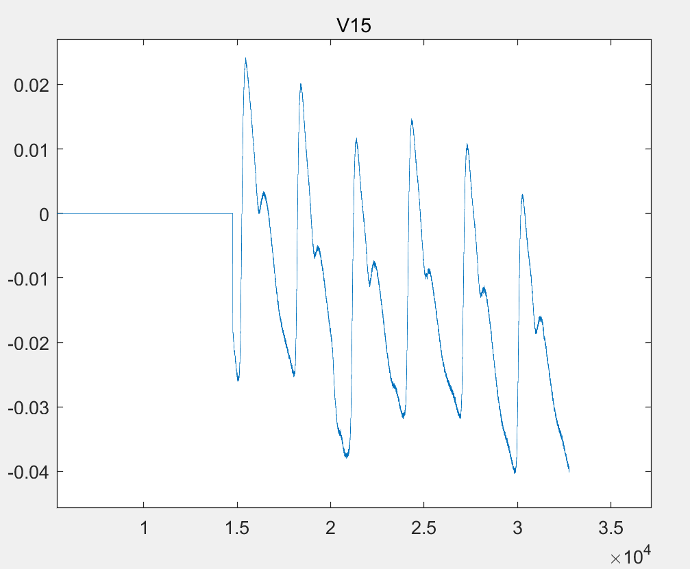
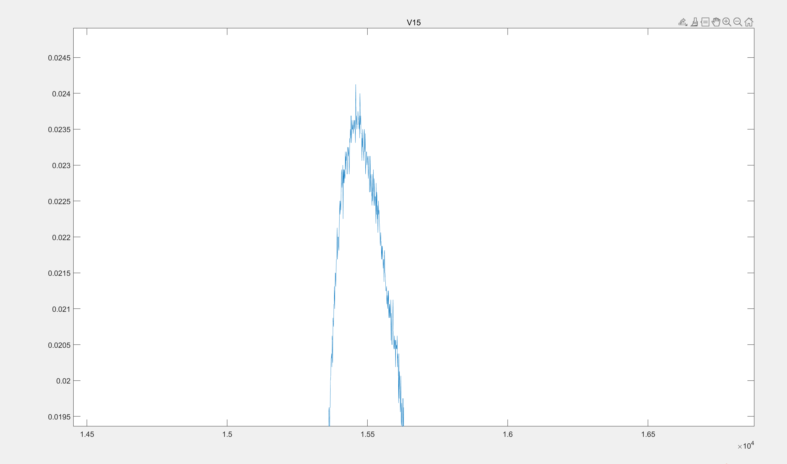
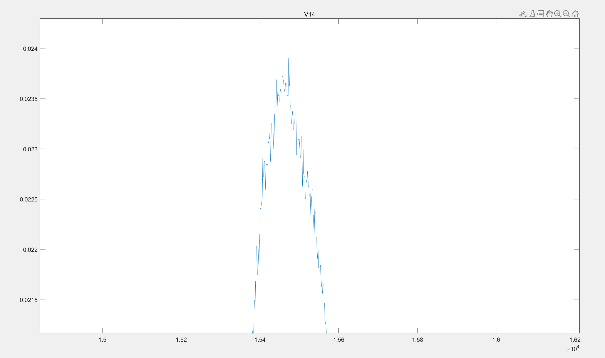
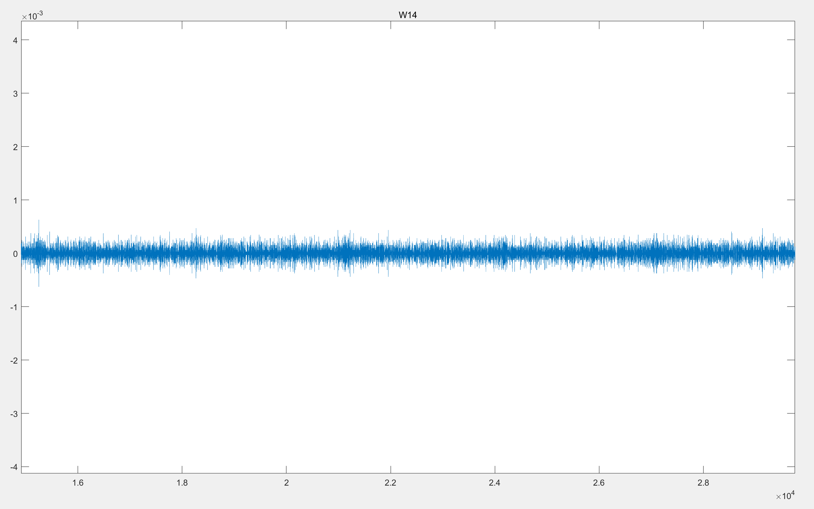
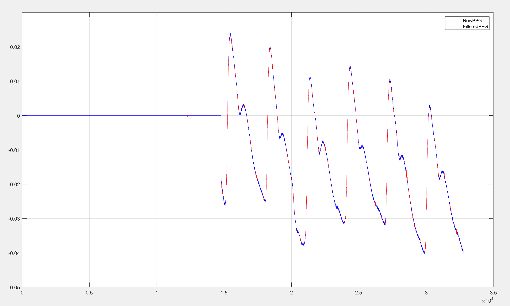
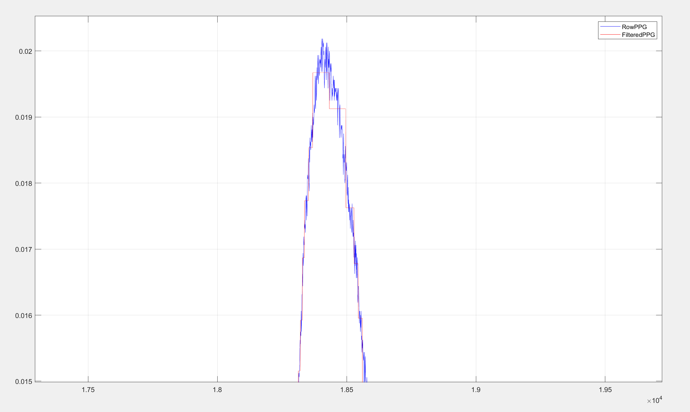

# Haar_Wavelet_Denoising
Built from 0, do not using any existing libraries or API. All created(except dataset) by myself.
I used the same dataset as toyexample as an example, thanks to the https://github.com/she014/PPG-signal-analysis-photoplythesmogram-.

# 1.Code Result

### 1.rowData

**whole graph:**

**peak graph:**

### 2.first level decomposition-approximate coefficient

### 3.first level decompositionData-detail coefficient

## 2.Result of denoising

